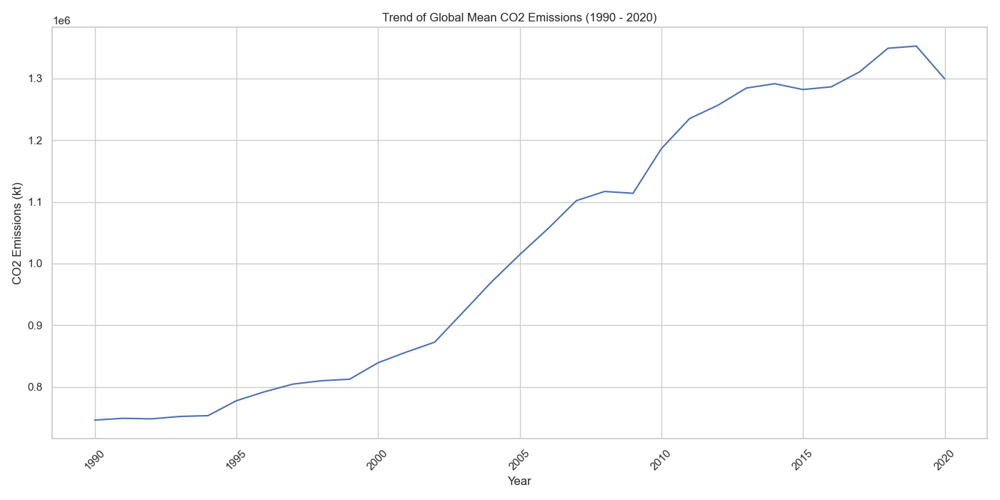
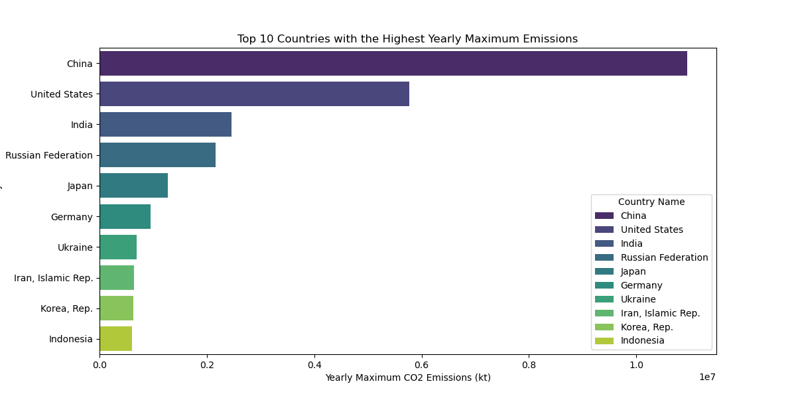

## 1. Motivation and purpose

As UNEP and IPCC officers, our mission is to educate the public about the escalating CO2 emissions that are fueling climate change, contaminating our air and oceans, triggering health issues, and inducing socioeconomic disruptions. Understanding the gravity of this crisis is crucial for safeguarding our environment, preserving public health, and securing a sustainable legacy. To empower people in confronting this challenge, we've developed the Global CO2 Emissions Tracker—a sophisticated dashboard that offers a comprehensive view of CO2 emissions through detailed time-series data, pinpointing sources and trends.

 This dashboard will help individuals to understand about the profound impact of CO2 emissions but also to evoke a tangible sense of the issue's urgency. They can track progress and be informed and can use it to assist on making decisions about personal and collective actions to reduce emissions. By transforming complex emissions data into a user-friendly visual narrative, the dashboard cultivates a deeper understanding and appreciation of the challenge at hand, inspiring active engagement and spurring on a united front to champion the cause of emissions reduction.

## 2. Description of the data
In our proposal, we will leverage a robust dataset focusing on carbon dioxide (CO2) emissions data from various countries and regions. Our dataset contains 239 rows and, after omitting the "Indicator Name" and "Indicator Code" columns, we will utilize 33 columns which consist of the 'Country Name', 'Country Code', and annual CO2 emissions data spanning from 1990 to 2020.

This data will be helpful to achieve our goal of creating an interactive dashboard to visualize CO2 emissions worldwide. By interacting with this dataset, our target audience, such as environmental policymakers, researchers, and educators, will be able to recognize patterns, trends, and outliers in emissions. Hopefully this can help them making decisions and strategies to mitigate climate change.

To enhance the utility of our visualizations, we will engineer new variables that include:

**Continent:** Assigning countries to their respective continents for regional analysis.
**Average Emissions:** Calculating the average emissions per year for all countries to identify global trends.
**Standard Deviation:** Providing insights into the year-by-year variability of emissions among countries.
**Maximum and Minimum Emissions:** Highlighting the highest and lowest CO2 emitting countries annually to pinpoint specific areas for policy intervention.
**Total Emission:** Summing up the emissions over a selected time period to understand the cumulative impact and guide long-term environmental planning.

Mean carbon emission trend plot:

Top10 country in carbon emission:

These engineered variables will enrich our analysis, enabling us to create more insightful and impactful visualizations. By examining the distribution, trends, and outliers in carbon emissions, we aim to provide valuable insights that can help our target audience in their efforts to address climate change.

## 3. Research questions
Mary is a warm-hearted Vancouverite deeply invested in her community. On her way to work today, she learned about Vancouver's ambitious plan to achieve 'net zero' emissions by 2050, a concept new to her. After a brief research, she became more interested in the topic and was eager to understand the broader context, to uncover the current status of global emissions. She wondered: How close are we to achieving 'net zero' globally? Are the world's largest emitters on track to meet these goals? What is the overall emissions landscape?

With these questions in mind, Mary accesses the 'Global CO2 Emissions Tracker.' Upon logging in, she will be greeted by a global map highlighting countries with higher emissions in darker shades. Adjacent to the map, a pie chart will offer a detailed breakdown of each country's contribution to global emissions. The interface will include several controls, allowing her to filter data by year, region, or specific countries of interest. A line chart will display the emission trends of selected countries, complemented by a histogram showcasing the top emitters in her chosen region.

Through her exploration, Mary may discover that global carbon emissions are escalating rapidly, though some major emitters are experiencing a slowdown in their growth rates. She may also realize that achieving 'net zero' emissions worldwide necessitates significant advancements. This revelation prompts her to consider what actions she can take in her daily life to contribute to reducing emissions.

## 4. App sketch and description
The dashboard of the Global CO2 Emission Tracker is composed of five components, designed to enrich user engagement and understanding. On the left, users are greeted with intuitive controls that allow for customization of data, including the selection of the specific range of years, countries, and continents of interest to CO2 emissions. Central to the dashboard is a dynamic map that highlights the chosen continents or countries, offering a visual representation of the user’s focus. Below this, a line chart unfolds the historical narrative of CO2 emission through a time series analysis, illustrating the trend of emissions by year. To the right, a pie chart offers perspectives on the selected region’s CO2 emissions, placed within the global context to underscore its relative impact. On the bottom right, there is a bar chart that displays the five highest CO2-emitting countries or regions within the same continent as the selected area. This chart provides a clear comparison of the total CO2 emissions, helping users understand how the selected country or region ranks among its continental peers.

